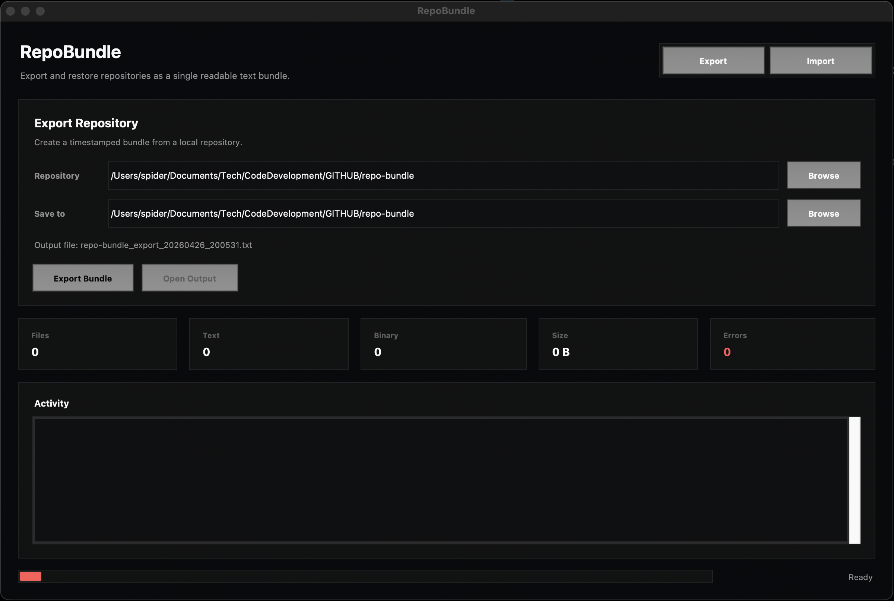

# RepoBundle

[](https://opensource.org/licenses/Apache-2.0)
[](https://www.python.org/downloads/)

A lightweight Python tool for exporting and importing entire repository contents into a single, human-readable text file. Perfect for sharing code repositories in environments where direct file transfer is not possible, or for creating portable backups of your projects.

## 🚀 Features

- **Single File Export**: Compress your entire repository into one text file
- **Binary File Support**: Automatically handles binary files with base64 encoding
- **Human-Readable Format**: Export format is easy to read and review
- **Hidden File Filtering**: Automatically skips `.git` directories and hidden files
- **Preserve Directory Structure**: Maintains the complete folder hierarchy
- **Graphical Interface**: Includes a Raycast-inspired desktop GUI for export/import workflows
- **Cross-Platform**: Works on Windows, macOS, and Linux

## 📋 Table of Contents

- [Installation](#installation)
- [Quick Start](#quick-start)
- [Usage](#usage)
  - [Using the GUI](#using-the-gui)
  - [Exporting a Repository](#exporting-a-repository)
  - [Importing a Repository](#importing-a-repository)
- [Export Format](#export-format)
- [Examples](#examples)
- [Use Cases](#use-cases)
- [Contributing](#contributing)
- [License](#license)
- [Author](#author)

## 🔧 Installation

RepoBundle requires Python 3.6 or higher. No external dependencies are needed - it uses only Python standard library modules.

```bash
# Clone the repository
git clone https://github.com/yourusername/RepoBundle.git
cd RepoBundle

# Make scripts executable (optional, Unix-based systems)
chmod +x scripts/export_repo.py
chmod +x scripts/import_repo.py
chmod +x scripts/gui.py
```

## 🏃 Quick Start

### Export your current repository:
```bash
python scripts/export_repo.py
```

### Import from an export file:
```bash
python scripts/import_repo.py your_export_file.txt
```

### Launch the GUI:
```bash
python scripts/gui.py
```

## 📖 Usage

### Using the GUI

Launch the GUI when you want folder pickers, live activity logs, result summaries, and one-click access to the exported file or restored folder.



```bash
python scripts/gui.py
```

The GUI intentionally exposes only the core actions: select a repository, select where to save the bundle, export it, select an export file, select a restore folder, and import it.

### Exporting a Repository

The export script creates a timestamped text file containing all the repository contents.

```bash
# Export current directory
python scripts/export_repo.py

# Export a specific directory
python scripts/export_repo.py /path/to/your/repository

# Output: RepoName_export_YYYYMMDD_HHMMSS.txt
```

**Export Options:**
- If no path is specified, exports the current working directory
- Output filename is automatically generated with timestamp
- Hidden files and directories (starting with `.`) are automatically excluded

### Importing a Repository

The import script reconstructs the repository from an export file.

```bash
# Import to default directory (./restored_repo)
python scripts/import_repo.py export_file.txt

# Import to specific directory
python scripts/import_repo.py export_file.txt -o /path/to/output

# Command-line options:
# -o, --output: Specify output directory (default: ./restored_repo)
```

## 📄 Export Format

The export file follows a structured format that's both human and machine-readable:

```
================================================================================
REPOSITORY EXPORT: YourRepoName
Generated on: 2025-05-29T12:00:00
================================================================================

################################################################################
DIRECTORY: subdirectory
################################################################################

------------------------------------------------------------
FILE: subdirectory/example.py
------------------------------------------------------------

[File contents here]

============================================================

------------------------------------------------------------
FILE: subdirectory/image.png
------------------------------------------------------------

[Binary file - 1234 bytes - base64 encoded]
[Base64 encoded content here]

============================================================
```

## 💡 Examples

### Example 1: Backup a Project
```bash
# Create a backup of your project
cd ~/my-project
python ~/RepoBundle/scripts/export_repo.py

# This creates: my-project_export_20250529_120000.txt
```

### Example 2: Share Code via Email/Chat
```bash
# Export a small utility
python scripts/export_repo.py ~/utils/my-tool

# The resulting text file can be copied and pasted into emails,
# chat messages, or forum posts
```

### Example 3: Archive Multiple Versions
```bash
# Export with timestamp for version tracking
for version in v1.0 v2.0 v3.0; do
    git checkout $version
    python ~/RepoBundle/scripts/export_repo.py
done
```

## 🎯 Use Cases

1. **Code Sharing in Restricted Environments**: Share complete repositories where direct file transfer is blocked
2. **Forum/Email Code Sharing**: Post entire projects in forums or emails that only accept text
3. **Backup and Archival**: Create human-readable backups of your projects
4. **Code Review**: Export repositories for offline review or documentation
5. **Teaching and Learning**: Share complete example projects with students
6. **Cross-Platform Transfer**: Move projects between systems without compression tools

## 🤝 Contributing

Contributions are welcome! Here's how you can help:

1. Fork the repository
2. Create a feature branch (`git checkout -b feature/amazing-feature`)
3. Commit your changes (`git commit -m 'Add amazing feature'`)
4. Push to the branch (`git push origin feature/amazing-feature`)
5. Open a Pull Request

### Development Guidelines

- Keep the code simple and dependency-free
- Maintain backward compatibility
- Add comments for complex logic
- Test with various repository types and sizes

### Future Enhancements

- [ ] Add compression options for large repositories
- [ ] Support for custom ignore patterns
- [ ] Progress bars for large exports/imports
- [ ] Checksum verification for data integrity
- [ ] Incremental export capabilities

## 📝 License

This project is licensed under the Apache License 2.0 - see the [LICENSE](LICENSE) file for details.

## 👤 Author

**Nic Cravino**

Created: May 25th, 2025

---

<p align="center">
Made with ❤️ for developers who need to share code anywhere
</p>
